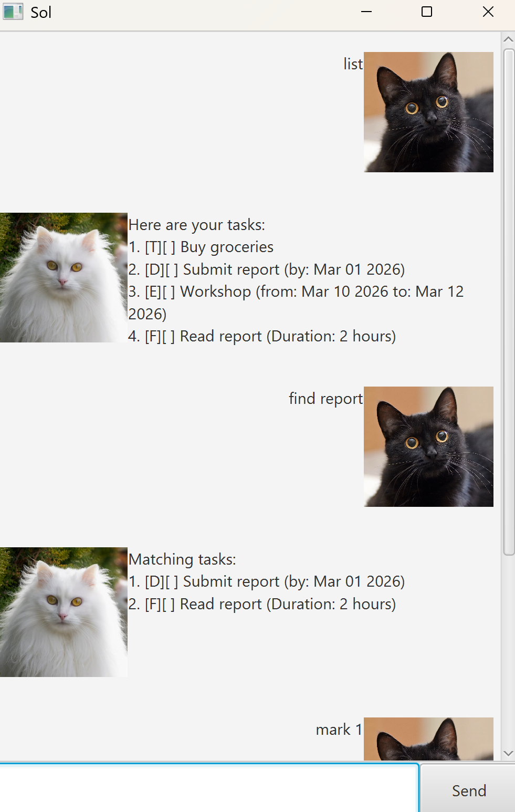

# Sol User Guide



Sol is a simple text-based chatbot to help you manage tasks, deadlines, events, and timed tasks.

## Adding todos

Add a simple task with a description. The task is stored and can be marked, unmarked, or deleted later.

Example: `todo Buy groceries`
```
[T][ ] Buy groceries
You now have 1 task.
```

## Adding deadlines

Add a task that must be completed by a certain date. The date is specified in `yyyy-MM-dd` format.

Example: `deadline Submit report /by 2026-03-01`

```
[D][ ] Submit report (by: Mar 01 2026)
You now have 2 tasks.
```

## Adding events

Add an event that has a start and end date. Both dates must be specified in `yyyy-MM-dd` format.

Example: `event Workshop /from 2026-03-10 /to 2026-03-12`

```
[E][ ] Workshop (from: Mar 10 2026 to: Mar 12 2026)
You now have 3 tasks.
```

## Adding fixed duration tasks

Add a task that requires a fixed duration to complete but does not have a fixed start/end time.
Example: `fixed Read report /duration 2`

```
[F][ ] Read report (Duration: 2 hours)
You now have 4 tasks.
```

## Listing tasks

Show all tasks currently in your task list with numbering and status.

Example: `list`

```
1. [T][ ] Buy groceries
2. [D][ ] Submit report (by: Mar 01 2026)
3. [E][ ] Workshop (from: Mar 10 2026 to: Mar 12 2026)
4. [F][ ] Read report (Duration: 2 hours)
```

## Marking and Unmarking Tasks

Mark a task as done or undone using its number in the list.

Example: `mark 2`

```
Marked the below task as completed.
[D][X] Submit report (by: Mar 01 2026)
```

Example: `unmark 2`

```
Marked the below task as incomplete.
[D][ ] Submit report (by: Mar 01 2026)
```

## Deleting Tasks

Remove a task from the list using its number.

Example: `delete 1`

```
Removed the below task from the list.
   [T][ ] Buy groceries
You now have 3 tasks.
```

## Searching Tasks

Find tasks that contain a keyword in the description.

Example: `find report`

```
[D][X] Submit report (by: Mar 01 2026)
[F][ ] Read report (Duration: 2 hours)
```